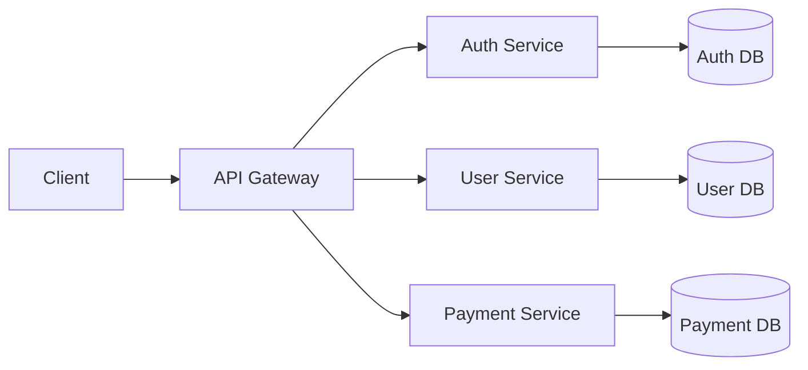

## 목차
- [1. Second Brain  memory 구축하기](#1-second-brain--memory-구축하기)
- [2. Lazy Loading — CLAUDE.md 참조 구조](#2-lazy-loading--claudemd-참조-구조)
- [3. 컨텍스트 윈도우 관리](#3-컨텍스트-윈도우-관리)
- [4. MCP 토큰 모니터링](#4-mcp-토큰-모니터링)
- [5. Mermaid 아키텍처 정리](#5-mermaid-아키텍처-정리)
- [6. 무거운 작업은 스크립트로 오프로드](#6-무거운-작업은-스크립트로-오프로드)

---

## 1. Second Brain & /memory 구축하기

Claude Code는 대화가 끝나면 맥락을 잊지만, **로컬 마크다운에 학습 내용을 저장**하면 프로젝트의 기관 기억(Institutional Memory)으로 활용할 수 있습니다.

### /memory 명령어

`/memory` 명령을 실행하면 Claude가 자동으로 학습한 내용을 확인하고 편집할 수 있습니다.

- 저장 위치: `~/.claude/projects/<project>/memory/MEMORY.md`
- 대화 중 "기억해줘"라고 말하면 해당 내용이 메모리에 저장됩니다.
- `/memory`로 저장된 내용을 언제든 확인할 수 있습니다.

### 개인 메모리 vs 팀 공유

| 구분 | 저장 방식 | 용도 |
|------|-----------|------|
| 개인 메모리 | `/memory` | 개인 학습 내용, 선호 설정 |
| 팀 공유 | `CLAUDE.md` | 프로젝트 규칙, 공통 컨벤션 |

> 개인 작업 습관은 `/memory`에, 팀 전체가 알아야 할 규칙은 `CLAUDE.md`에 분리하세요.

---

## 2. Lazy Loading — CLAUDE.md 참조 구조

CLAUDE.md에 모든 정보를 넣으면 매 대화마다 불필요한 토큰을 소비합니다. **참조만 두고 상세 내용은 별도 파일로 분리**하는 것이 핵심입니다.

<details>
<summary>나쁜 예: 모든 API 스펙을 CLAUDE.md에 직접 작성</summary>

<pre><code class="language-markdown"># CLAUDE.md
## API 스펙
### POST /users
- Request Body: { name: string, email: string, ... }
- Response: { id: number, name: string, ... }
### GET /users/:id
...
(수백 줄의 API 스펙이 계속됨)
</code></pre>

<p>매 대화마다 이 모든 내용이 로드되어 토큰을 낭비합니다.</p>
</details>

<details>
<summary>좋은 예: 참조만 두고 상세는 별도 파일로</summary>

<pre><code class="language-markdown"># CLAUDE.md
## API 스펙
자세한 내용은 @docs/api-spec.md 참조
</code></pre>

<p>필요할 때만 해당 파일을 읽으므로 토큰을 절약합니다.</p>
</details>

### 폴더별 CLAUDE.md

폴더별로 `CLAUDE.md`를 배치하면 해당 폴더 작업 시에만 로드됩니다.

```
src/
  auth/
    CLAUDE.md      # 인증 관련 규칙만
  payment/
    CLAUDE.md      # 결제 관련 규칙만
CLAUDE.md          # 프로젝트 공통 규칙
```

> 폴더별 CLAUDE.md는 해당 디렉토리의 파일을 수정할 때만 자동으로 참조됩니다. 전체 프로젝트 규칙은 루트 CLAUDE.md에 두세요.

---

## 3. 컨텍스트 윈도우 관리

### 핵심 원칙: 한 세션 = 한 피처

하나의 대화에서 여러 기능을 구현하면 컨텍스트가 오염되고 품질이 떨어집니다. 작업 단위를 작게 유지하세요.

### 실전 워크플로우

1. **Plan Mode**로 전체 구현 계획 수립
2. `/clear`로 컨텍스트 초기화
3. 첫 번째 단계만 구현
4. `/clear`로 다시 초기화
5. 다음 단계 구현 (반복)

### /clear vs /compact 비교

| 명령 | 동작 | 사용 시점 |
|------|------|-----------|
| `/clear` | 대화 내역 완전 초기화 | 작업 단위가 바뀔 때 |
| `/compact` | 대화 내역을 요약하여 압축 | 같은 작업을 이어가되 토큰을 절약할 때 |

> `/clear`는 백지 상태로 돌아가고, `/compact`는 맥락을 유지하면서 압축합니다. 작업 전환 시에는 `/clear`, 같은 작업 내에서 토큰이 부족할 때는 `/compact`를 사용하세요.

---

## 4. MCP 토큰 모니터링

MCP(Model Context Protocol) 서버를 여러 개 연결하면 **도구 설명(tool description)만으로도 상당한 토큰을 소비**합니다.

### 점검 방법

- `/context` 명령으로 현재 토큰 사용량을 주기적으로 확인하세요.
- 사용하지 않는 MCP 서버는 비활성화하여 토큰을 절약하세요.

### 토큰 절약 팁: 커스텀 MCP 래핑

자주 사용하는 MCP 도구 조합을 하나의 커스텀 MCP로 래핑하면, 도구 설명에 사용되는 토큰을 줄일 수 있습니다.

> MCP 서버가 5개 이상 연결된 경우, 도구 설명만으로 수천 토큰이 소비될 수 있습니다. 꼭 필요한 MCP만 활성화하세요.

---

## 5. Mermaid 아키텍처 정리

CLAUDE.md에 **Mermaid 다이어그램으로 프로젝트 아키텍처를 정리**하면 Claude가 전체 구조를 빠르게 파악할 수 있습니다.

### 예시

```markdown
# CLAUDE.md

## 아키텍처
자세한 내용은 @docs/architecture.md 참조
```



### 권장 방식

- 별도 파일(예: `docs/architecture.md`)에 Mermaid 다이어그램을 정리합니다.
- CLAUDE.md에서는 해당 파일을 참조만 합니다.
- 아키텍처가 변경될 때마다 다이어그램도 함께 업데이트하세요.

---

## 6. 무거운 작업은 스크립트로 오프로드

무거운 데이터 처리를 대화 안에서 직접 시키면 **컨텍스트가 오염**됩니다. 스크립트를 작성하게 하고, 실행 결과만 전달받는 방식이 효율적입니다.

### 오프로드 패턴

| 작업 | 나쁜 방식 | 좋은 방식 |
|------|-----------|-----------|
| DB 마이그레이션 검증 | 대화 내에서 전체 스키마 비교 | 검증 스크립트 생성 후 결과만 확인 |
| 로그 분석 | 대화 내에서 로그 파일 전체 읽기 | 분석 스크립트 생성 후 요약 결과만 확인 |
| API 응답 비교 | 대화 내에서 두 응답 전체 비교 | 비교 스크립트 생성 후 차이점만 확인 |

> "이 데이터를 분석해줘"가 아니라 "이 데이터를 분석하는 스크립트를 만들어줘"로 요청하세요. 스크립트 실행은 컨텍스트 윈도우를 소비하지 않습니다.
